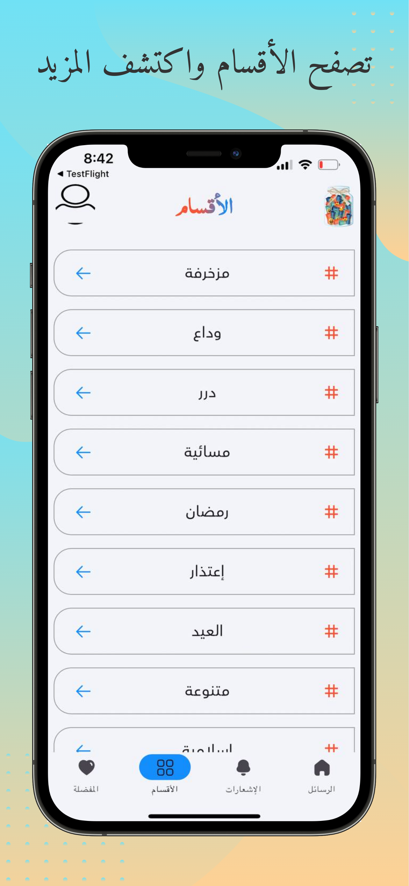

<div align="center">


# برطمان السعادة - Happiness Jar
</div>

## 🚀 Getting Started
- In project, I used Provider for state management and followed the MVVM design pattern to achieve a flexible and maintainable application architecture.
- This application sends you daily positive messages to uplift your spirits and bring joy to your day. Enjoy inspiring quotes, helpful tips, and loving messages to share with your loved ones. Get a daily dose of happiness and optimism, and make your day brighter!

## 🤳 Screens

- **Messages Screen:** Find daily uplifting messages.
- **Notifications Screen:** Get notifications for new messages.
- **Categories Screen:** Explore messages categorized by themes and interests.
- **Favorite Screen:** Access your saved favorite messages.

## 📁 File Structure


## 📱 Android Screenshots

<div align="center">
<table>
<tr>
    <td></td>
    <td></td>
    <td></td>
    <td></td>
  </tr>
  <tr>
    <td></td>
    <td></td>
    <td></td>
    <td></td>
  </tr>
</table>
</div>

## 📱 iOS Screenshots

<div align="center">
<table>
<tr>
    <td></td>
    <td></td>
    <td></td>
    <td></td>
  </tr>
  <tr>
    <td></td>
    <td></td>
    <td></td>
    <td></td>
  </tr>
</table>
</div>

## 🛠 Dependencies

```pubspec.yaml
  iconly: ^1.0.1
  provider: ^6.1.1
  get_it: ^7.2.0
  shared_preferences: ^2.2.2
  shimmer: ^3.0.0
  auto_size_text: ^3.0.0
  dio: ^5.4.3+1
  pretty_dio_logger: ^1.3.1
  sqflite: ^2.0.2
  path: ^1.8.0
  easy_localization: ^3.0.0
  share_plus: ^8.0.3
  clipboard: ^0.1.3
  top_snackbar_flutter: ^3.1.0
  image_picker: ^0.8.4+3
  path_provider: ^2.1.3
  firebase_core: ^3.1.0
  firebase_crashlytics: ^4.0.1
  firebase_analytics: ^11.0.1
  firebase_messaging: ^15.0.1
  permission_handler: ^11.3.1
  app_settings: ^5.1.1
  in_app_review: ^2.0.9
  lottie: ^1.2.1
  flutter_svg: ^2.0.10+1
  url_launcher: ^6.3.0
  package_info_plus: ^8.0.0
  screenshot: ^3.0.0
  image_gallery_saver: ^2.0.3
  google_mobile_ads: ^5.1.0
  flutter_fortune_wheel: ^1.3.1
  cached_network_image: ^3.3.1
```

## ☢️ Usage

1. **Clone the repository**

2. **Open the project in your preferred Flutter IDE.**

3. **Explore the `lib` directory:**

    - Review the project structure to understand the core of the app.
    - Customize the app of your need.

4. **Run the app on an emulator or physical device:**

    ```bash
    flutter run
    ```

## 🚨 Contributing

- Contributions are welcome 💜
- If you encounter any issues or have suggestions for improvements, please open an issue or submit a pull request.
